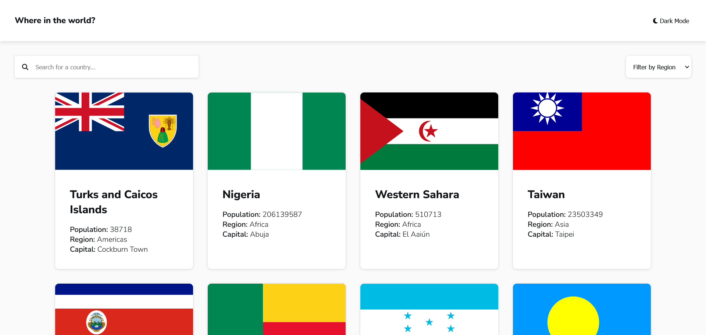

# Frontend Mentor - REST Countries API with color theme switcher solution

This is a solution to the [REST Countries API with color theme switcher challenge on Frontend Mentor](https://www.frontendmentor.io/challenges/rest-countries-api-with-color-theme-switcher-5cacc469fec04111f7b848ca). Frontend Mentor challenges help you improve your coding skills by building realistic projects. 

## Table of contents

- [Overview](#overview)
  - [The challenge](#the-challenge)
  - [Screenshot](#screenshot)
  - [Links](#links)
- [My process](#my-process)
  - [Built with](#built-with)
  - [What I learned](#what-i-learned)
  - [Useful resources](#useful-resources)
- [Author](#author)

## Overview

### The challenge

Users should be able to:

- See all countries from the API on the homepage
- Search for a country using an `input` field
- Filter countries by region
- Click on a country to see more detailed information on a separate page
- Click through to the border countries on the detail page
- Toggle the color scheme between light and dark mode *(optional)*

### Screenshot

## My process

### Links

- Live Site URL: [Add live site URL here](https://rest-countries-api-steel-mu.vercel.app/)

### Built with

- Flexbox
- CSS Grid
- Mobile-first workflow
- [Vite](https://vitejs.dev/) - Vite
- [Vue](https://vuejs.org/) - Vue

### Useful resources

- [stackoverflow](https://stackoverflow.com/questions/67166361/why-does-an-object-change-into-a-proxy-object-in-vue) - I had difficulty operating on data from an API because I didn't know that Vue converts objects into proxy objects, which don't have methods like map and filter.

## Author

- Frontend Mentor - [@jakubzapadka](https://www.frontendmentor.io/profile/JakubZapadka)
